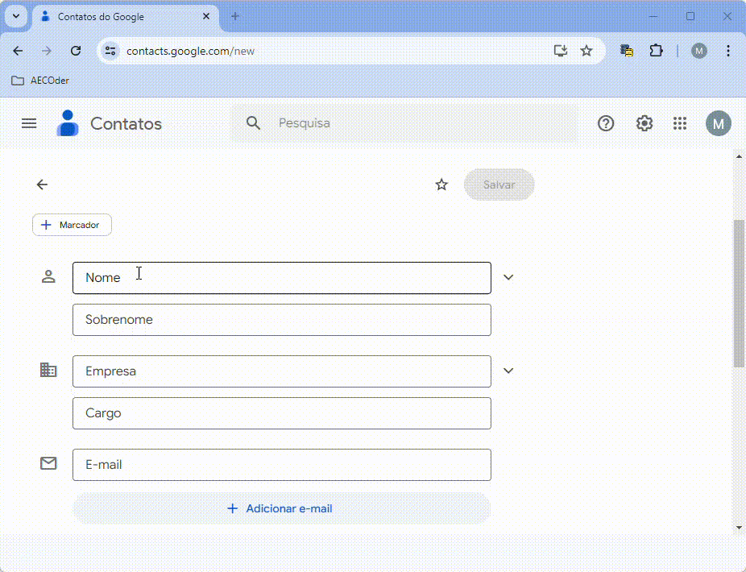

# Input Values Saver Chrome Extension



A Chrome extension that saves and fills standard values for all inputs present on a webpage. This extension provides buttons to save and fill the standard values for input fields, making it easier to manage repetitive form data.

## Features

- Save standard values for input fields on a webpage.
- Fill input fields with saved standard values.

## Installation

1. **Clone the repository:**
    ```sh
    git clone https://github.com/mayconrfreitas/inputs-values-saver.git
    cd inputs-values-saver
    ```

2. **Open Chrome and go to the Extensions page:**
    - Navigate to `chrome://extensions/` in your Chrome browser.

3. **Enable Developer mode:**
    - Toggle the switch for Developer mode in the top right corner of the page.

4. **Load the unpacked extension:**
    - Click the "Load unpacked" button and select the folder [inputs-values-saver-extension](./inputs-values-saver-extension/) where you cloned the repository.

5. **Pin the extension for easy access:**
    - Click on the extensions icon (puzzle piece) in the top right corner of Chrome.
    - Find "Input Values Saver" and click the pin icon next to it.

## Usage

1. **Save Standard Values:**
    - Navigate to a webpage with input fields.
    - Click the "Input Values Saver" extension icon.
    - Click the "Save Standard Values" button.
    - A new popup will appear with all input fields listed. Fill in the standard values you want to save and click the "Save" button.

2. **Fill Standard Values:**
    - Navigate to the same webpage where you saved the standard values.
    - Click the "Input Values Saver" extension icon.
    - Click the "Fill Standard Values" button. The input fields will be filled with the saved standard values.

## Contributing

Contributions are welcome! Please follow these steps to contribute:

1. **Fork the repository:**
    - Click the "Fork" button at the top right of this page.

2. **Clone your fork:**
    ```sh
    git clone https://github.com/mayconrfreitas/inputs-values-saver.git
    cd inputs-values-saver
    ```

3. **Create a new branch:**
    ```sh
    git checkout -b feature/your-feature-name
    ```

4. **Make your changes and commit:**
    - Make the changes to the codebase.
    - Commit your changes with a clear and descriptive commit message.

    ```sh
    git add .
    git commit -m "Add feature: your feature description"
    ```

5. **Push your changes:**
    ```sh
    git push origin feature/your-feature-name
    ```

6. **Create a Pull Request:**
    - Go to the repository on GitHub.
    - Click the "New Pull Request" button.
    - Provide a clear description of your changes and submit the pull request.

## License

This project is licensed under the MIT License. See the [LICENSE](LICENSE) file for details.

